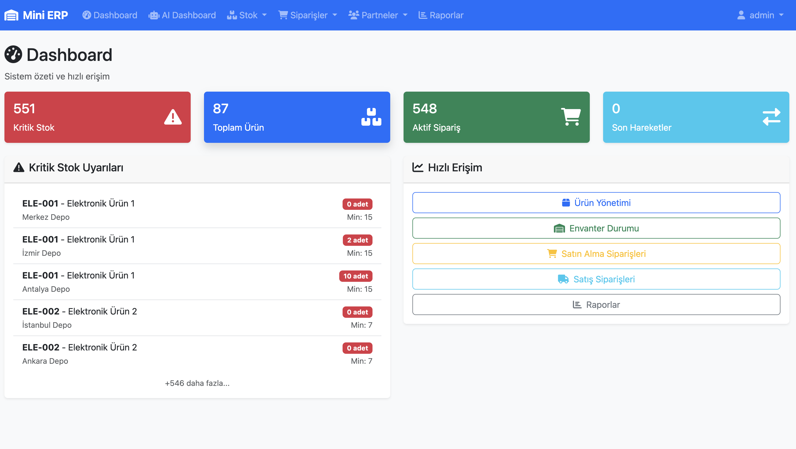
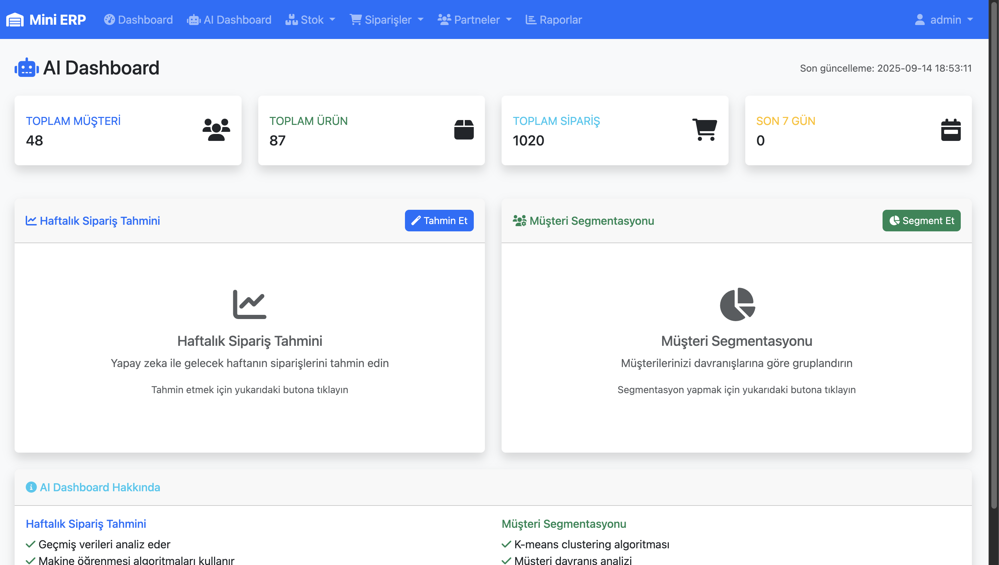
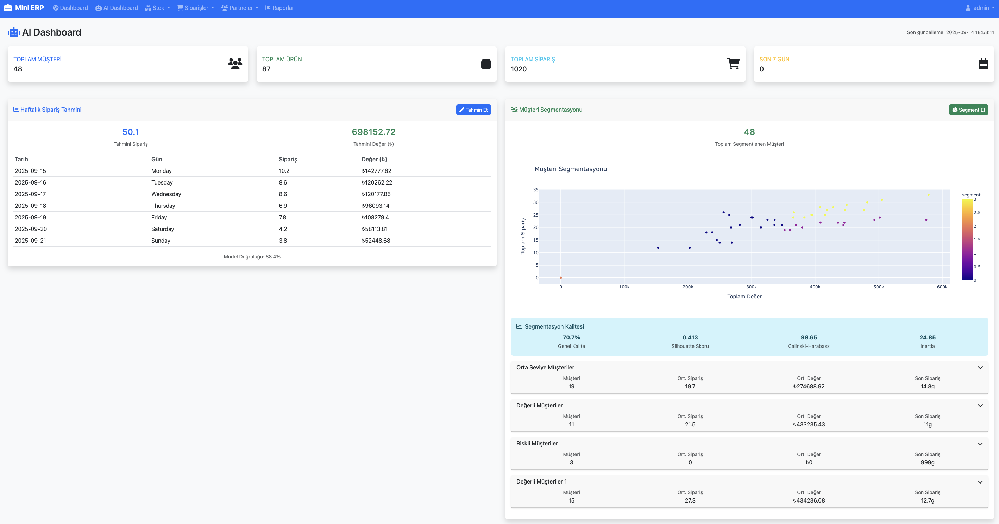
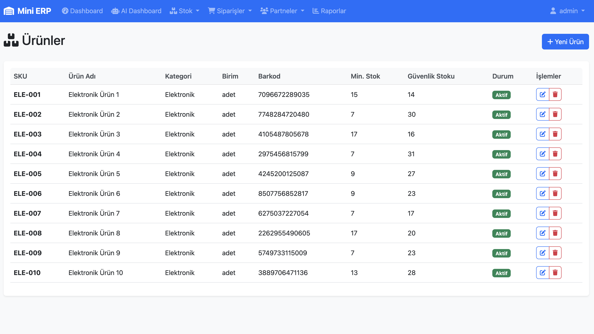
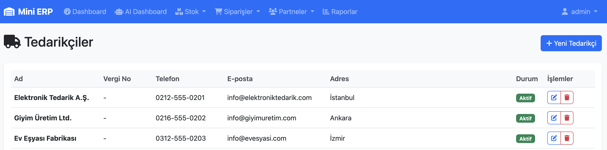
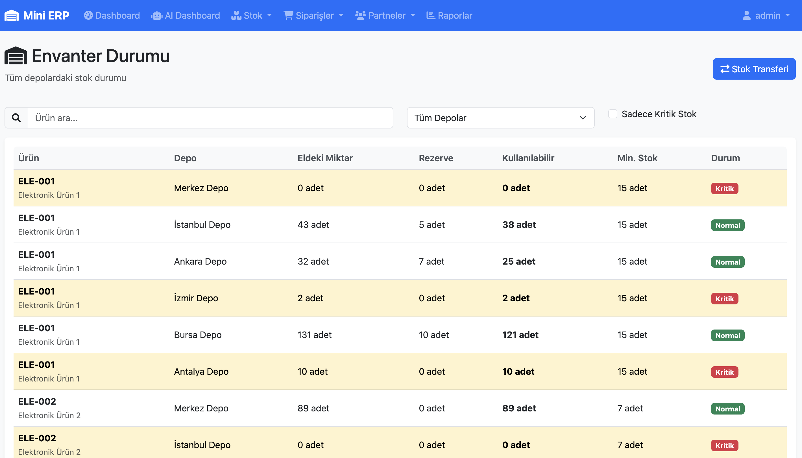
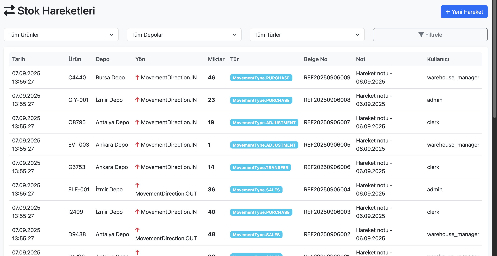
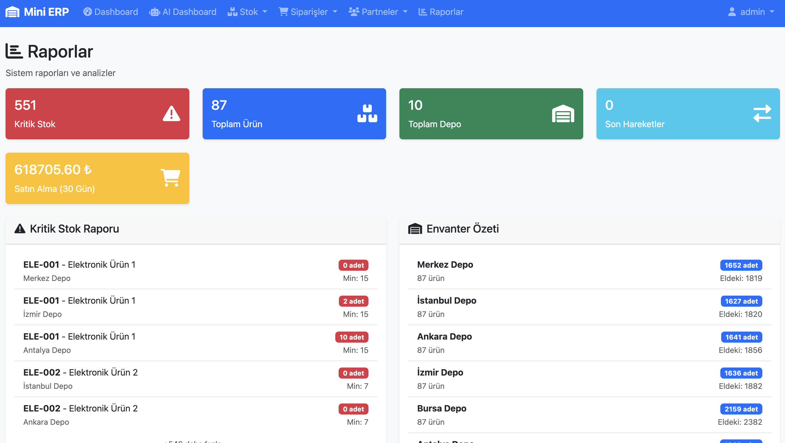
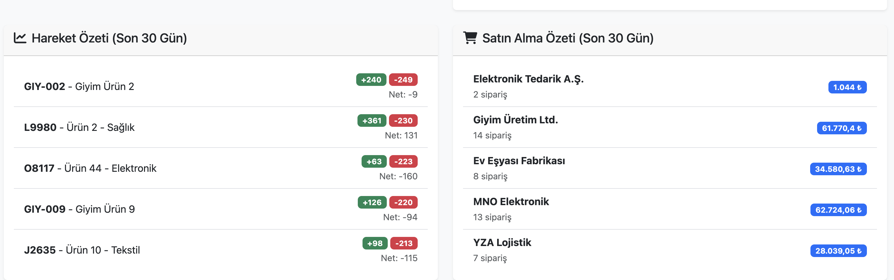
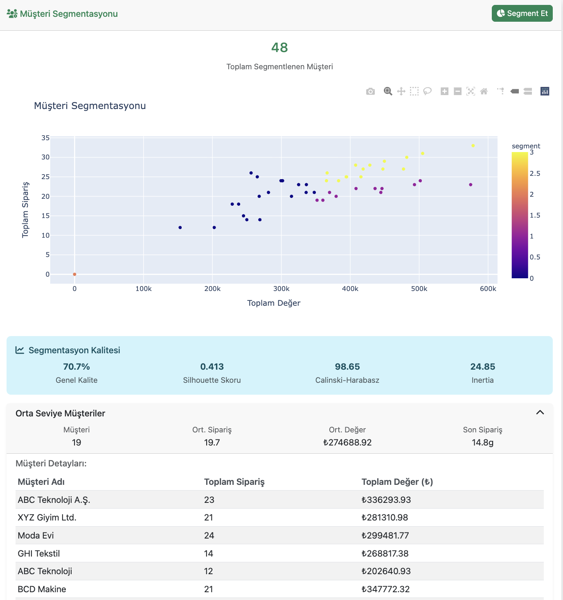

# Mini ERP - Stok & Envanter Takip Sistemi

Kurumsal ERP'lerdeki MM (Material Management) modülünün küçültülmüş, CV'de güçlü görünen, üretime yakın bir versiyonu.

## 🖼️ Ekran Görüntüleri

### 📊 Ana Dashboard

*Ana dashboard - Genel sistem özeti ve hızlı erişim menüleri*

### 🤖 AI Destekli Dashboard

*Yapay zeka destekli analiz dashboard'u*


*AI dashboard - Gelişmiş analiz ve tahmin özellikleri*

### 📦 Ürün Yönetimi

*Ürün listesi ve yönetim sayfası*

### 🏢 Tedarikçi Yönetimi

*Tedarikçi bilgileri ve yönetim paneli*

### 📊 Envanter Takibi

*Envanter durumu ve stok takibi*

### 🔄 Stok Hareketleri

*Stok giriş/çıkış hareketleri*

### 📈 Raporlar

*Detaylı raporlama sayfası*


*Raporlama dashboard'u ve analiz grafikleri*

### 👥 Müşteri Segmentasyonu

*AI destekli müşteri segmentasyonu analizi*

---

## Özellikler

### 🏭 Temel Modüller
- **Ürün Yönetimi**: SKU, kategori, barkod, minimum stok takibi
- **Depo Yönetimi**: Çoklu depo desteği, adres bilgileri
- **Stok Hareketleri**: Giriş/çıkış, transfer, düzeltme işlemleri
- **Satın Alma**: Sipariş oluşturma, onay, mal kabul süreçleri
- **Satış**: Sipariş oluşturma, onay, sevkiyat süreçleri
- **Partner Yönetimi**: Tedarikçi ve müşteri bilgileri
- **Yeniden Sipariş Kuralları**: Otomatik sipariş önerileri

### 📊 Raporlama & Analiz
- Kritik stok uyarıları
- Depo bazlı stok durumu
- En çok hareket gören ürünler
- Dönemsel giriş-çıkış raporları
- Dashboard ile hızlı erişim

### 🔐 Güvenlik
- JWT tabanlı kimlik doğrulama
- Rol bazlı erişim kontrolü (admin, warehouse_manager, clerk, viewer)
- Audit log ile değişiklik takibi

## Teknolojiler

- **Backend**: Python Flask 3.1.2
- **Veritabanı**: SQLite (geliştirme), PostgreSQL (opsiyonel prod)
- **ORM**: SQLAlchemy 2.0
- **Frontend**: HTML5, CSS3, JavaScript (ES6+), Bootstrap 5
- **API**: RESTful API tasarımı
- **Kimlik Doğrulama**: Flask-JWT-Extended
- **Deployment**: Docker & Docker Compose

## Kurulum

### Geliştirme Ortamı

1. **Repository'yi klonlayın**
```bash
git clone <repository-url>
cd mini_erp
```

2. **Virtual environment oluşturun**
```bash
python -m venv venv
source venv/bin/activate  # Linux/Mac
# veya
venv\Scripts\activate  # Windows
```

3. **Bağımlılıkları yükleyin**
```bash
pip install -r requirements.txt
```

4. **Veritabanını oluşturun ve seed data ekleyin**
```bash
python seed_data.py
```

5. **Uygulamayı çalıştırın**
```bash
python app.py
```

Uygulama http://localhost:5001 adresinde çalışacaktır.

### Docker ile Çalıştırma

1. **Docker Compose ile çalıştırın**
```bash
docker-compose up --build
```

2. **Seed data ekleyin**
```bash
docker-compose exec mini-erp python seed_data.py
```

## Kullanım

### Test Kullanıcıları

Seed data ile birlikte aşağıdaki test kullanıcıları oluşturulur:

- **Admin**: `admin` / `admin123`
- **Depo Müdürü**: `warehouse_manager` / `warehouse123`
- **Kâtip**: `clerk` / `clerk123`

### Temel İş Akışları

#### 1. Satın Alma → Depoya Giriş
1. Tedarikçi oluştur
2. Satın alma siparişi oluştur (Draft)
3. Siparişi onayla
4. Mal kabul işlemi yap (stok girişi)

#### 2. Satış → Depodan Çıkış
1. Müşteri oluştur
2. Satış siparişi oluştur (Draft)
3. Siparişi onayla
4. Sevkiyat işlemi yap (stok çıkışı)

#### 3. Stok Transferi
1. Ürün seç
2. Kaynak ve hedef depo belirle
3. Transfer miktarını gir
4. Transfer işlemini onayla

#### 4. Kritik Stok Uyarıları
- Dashboard'da otomatik olarak görüntülenir
- Available quantity <= reorder_point olan ürünler listelenir
- Yeniden sipariş kuralları varsa öneri gösterilir

## API Dokümantasyonu

### Kimlik Doğrulama
```bash
# Giriş
POST /api/auth/login
{
  "username": "admin",
  "password": "admin123"
}

# Kayıt
POST /api/auth/register
{
  "username": "newuser",
  "email": "user@example.com",
  "password": "password123",
  "role": "clerk"
}
```

### Ürün Yönetimi
```bash
# Tüm ürünleri listele
GET /api/products

# Ürün oluştur
POST /api/products
{
  "sku": "PROD-001",
  "name": "Ürün Adı",
  "category": "Kategori",
  "unit": "adet",
  "barcode": "1234567890123",
  "reorder_point": 10,
  "safety_stock": 20
}

# Ürün güncelle
PUT /api/products/{id}

# Ürün sil
DELETE /api/products/{id}
```

### Stok Yönetimi
```bash
# Stok hareketleri
GET /api/stock/movements

# Stok hareketi oluştur
POST /api/stock/movements
{
  "product_id": 1,
  "warehouse_id": 1,
  "direction": "IN",
  "quantity": 10,
  "movement_type": "Purchase",
  "note": "Satın alma girişi"
}

# Envanter durumu
GET /api/stock/inventory

# Stok transferi
POST /api/stock/transfer
{
  "product_id": 1,
  "from_warehouse_id": 1,
  "to_warehouse_id": 2,
  "quantity": 5,
  "note": "Depo transferi"
}
```

### Raporlar
```bash
# Dashboard verileri
GET /api/reports/dashboard

# Kritik stok raporu
GET /api/reports/low-stock

# Envanter özeti
GET /api/reports/inventory-summary

# Hareket özeti
GET /api/reports/movement-summary?days=30
```

## Geliştirme

### Proje Yapısı
```
mini_erp/
├── app/
│   ├── models/          # Veritabanı modelleri
│   ├── routes/          # API endpoint'leri
│   ├── services/        # İş mantığı servisleri
│   └── utils/           # Yardımcı fonksiyonlar
├── frontend/
│   ├── templates/       # HTML şablonları
│   └── static/          # CSS, JS, resimler
├── tests/               # Test dosyaları
├── migrations/          # Veritabanı migration'ları
└── config.py           # Konfigürasyon
```

### Test Çalıştırma
```bash
# Tüm testleri çalıştır
python -m pytest tests/

# Coverage ile test çalıştır
python -m pytest --cov=app tests/
```

### Veritabanı Migration
```bash
# Migration oluştur
flask db migrate -m "Migration message"

# Migration uygula
flask db upgrade
```

## Lisans

  

## Katkıda Bulunma

1. Fork yapın
2. Feature branch oluşturun (`git checkout -b feature/amazing-feature`)
3. Commit yapın (`git commit -m 'Add amazing feature'`)
4. Push yapın (`git push origin feature/amazing-feature`)
5. Pull Request oluşturun

## İletişim

Proje hakkında sorularınız için issue oluşturabilirsiniz.

